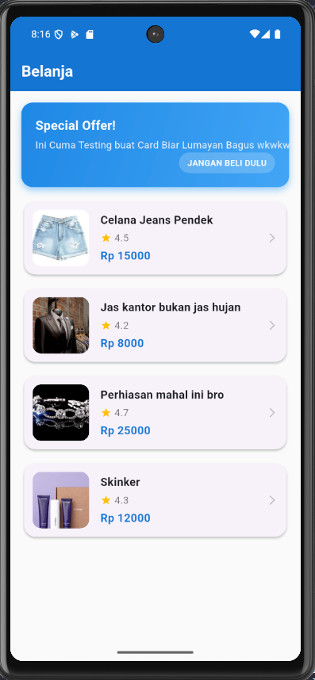
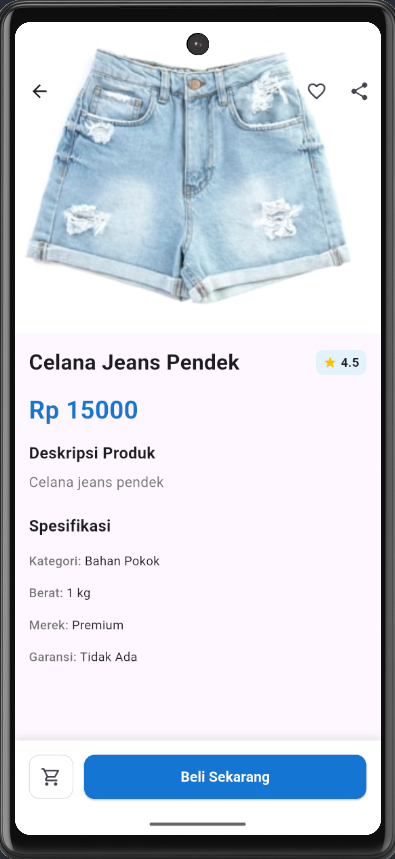
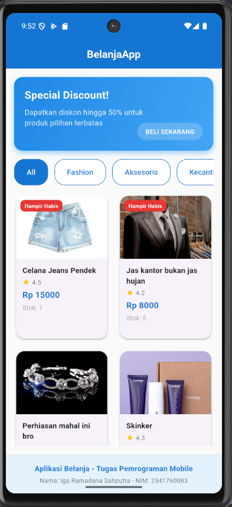
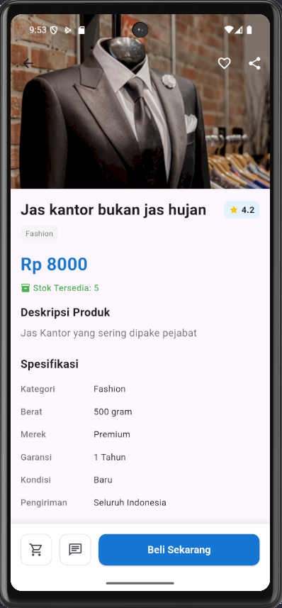

# 📱 Praktikum Flutter — Layout dan Navigasi

**Mata Kuliah:** Pemrograman Mobile
**Nama:** Iga Ramadana Sahputra  
**NIM:** 2341760083  
**Kelas:** SIB 3C  
**No Absen:** 15

**Repository:** [PMB_JS05 - Layout dan Navigasi](https://github.com/igaramadana/belanja)

---

## 📌 Praktikum 1: Membangun Navigasi di Flutter

### Langkah 1: Mendefinisikan Route

```dart
class HomePage extends StatelessWidget {
  const HomePage({super.key});

  @override
  Widget build(BuildContext context) {
    throw UnimplementedError();
  }
}
```

---

```dart
class ItemPage extends StatelessWidget {
  const ItemPage({super.key});

  @override
  Widget build(BuildContext context) {
    throw UnimplementedError();
  }
}
```

### Langkah 3: Lengkapi Kode di main.dart

```dart
import 'package:flutter/material.dart';

void main() {
class MyApp extends StatelessWidget {
  @override
  Widget build(BuildContext context) {
    return MaterialApp(
      initialRoute: '/',
      routes: {
        '/': (context) => const HomePage(),
        '/item': (context) => const ItemPage(),
      },
    );
  }
}
}
```

---

### Langkah 4: Membuat data model

```dart
class Item {
  String name;
  int price;
  String imageUrl;
  String description;
  double rating;
  int stock;

  Item({
    this.name = '',
    this.price = 0,
    this.imageUrl = '',
    this.description = '',
    this.rating = 0.0,
    this.stock = 0,
  });
}
```

---

### Langkah 5: Lengkapi kode di class HomePage

```dart
class HomePage extends StatelessWidget {
    final List<Item> items = [
        Item(name: 'Sugar', price: 5000),
        Item(name: 'Salt', price: 2000)
    ]
}
```

---

### Langkah 6 dan 7 : Menambahkan ListView, itemBuilder, dan ListView versi saya sendiri

```dart
import 'package:belanja/models/item.dart';
import 'package:flutter/material.dart';

class HomePage extends StatelessWidget {
  final List<Item> items = [
    Item(
      name: 'Celana Jeans Pendek',
      price: 15000,
      imageUrl:
          'https://images.unsplash.com/photo-1591195853828-11db59a44f6b?w=400',
      description: 'Celana jeans pendek',
      rating: 4.5,
    ),
    Item(
      name: 'Jas kantor bukan jas hujan',
      price: 8000,
      imageUrl:
          'https://images.unsplash.com/photo-1598808503746-f34c53b9323e?w=400',
      description: 'Jas Kantor yang sering dipake pejabat',
      rating: 4.2,
    ),
    Item(
      name: 'Perhiasan mahal ini bro',
      price: 25000,
      imageUrl:
          'https://images.unsplash.com/photo-1573408301185-9146fe634ad0?w=400',
      description: 'Perhiasan mahal ini yg dipake pejabat',
      rating: 4.7,
    ),
    Item(
      name: 'Skinker',
      price: 12000,
      imageUrl:
          'https://images.unsplash.com/photo-1571781926291-c477ebfd024b?w=400',
      description: 'Skinker biar glowing katanya',
      rating: 4.3,
    ),
  ];

  HomePage({Key? key}) : super(key: key);

  @override
  Widget build(BuildContext context) {
    return Scaffold(
      appBar: AppBar(
        title: const Text(
          'Belanja',
          style: TextStyle(fontWeight: FontWeight.bold, color: Colors.white),
        ),
        backgroundColor: Colors.blue.shade700,
        elevation: 0,
      ),
      body: Container(
        color: Colors.grey.shade50,
        child: Column(
          children: [
            // Header dengan banner
            Container(
              width: double.infinity,
              height: 120,
              margin: const EdgeInsets.all(16),
              decoration: BoxDecoration(
                gradient: LinearGradient(
                  colors: [Colors.blue.shade600, Colors.blue.shade400],
                  begin: Alignment.topLeft,
                  end: Alignment.bottomRight,
                ),
                borderRadius: BorderRadius.circular(16),
                boxShadow: [
                  BoxShadow(
                    color: Colors.blue.shade200,
                    blurRadius: 8,
                    offset: const Offset(0, 4),
                  ),
                ],
              ),
              child: Stack(
                children: [
                  Positioned(
                    left: 20,
                    top: 20,
                    child: Column(
                      crossAxisAlignment: CrossAxisAlignment.start,
                      children: [
                        Text(
                          'Special Offer!',
                          style: TextStyle(
                            color: Colors.white,
                            fontSize: 18,
                            fontWeight: FontWeight.bold,
                          ),
                        ),
                        SizedBox(height: 4),
                        Text(
                          'Ini Cuma Testing buat Card Biar Lumayan Bagus wkwkwk',
                          style: TextStyle(
                            color: Colors.white.withOpacity(0.9),
                            fontSize: 14,
                          ),
                        ),
                      ],
                    ),
                  ),
                  Positioned(
                    right: 20,
                    bottom: 20,
                    child: Container(
                      padding: EdgeInsets.symmetric(
                        horizontal: 12,
                        vertical: 6,
                      ),
                      decoration: BoxDecoration(
                        color: Colors.white.withOpacity(0.2),
                        borderRadius: BorderRadius.circular(20),
                      ),
                      child: Text(
                        'JANGAN BELI DULU',
                        style: TextStyle(
                          color: Colors.white,
                          fontSize: 12,
                          fontWeight: FontWeight.bold,
                        ),
                      ),
                    ),
                  ),
                ],
              ),
            ),

            // List produk
            Expanded(
              child: ListView.builder(
                padding: const EdgeInsets.symmetric(horizontal: 16),
                itemCount: items.length,
                itemBuilder: (context, index) {
                  final item = items[index];
                  return Container(
                    margin: const EdgeInsets.only(bottom: 12),
                    child: InkWell(
                      onTap: () {
                        Navigator.pushNamed(context, '/item', arguments: item);
                      },
                      borderRadius: BorderRadius.circular(16),
                      child: Card(
                        elevation: 2,
                        shape: RoundedRectangleBorder(
                          borderRadius: BorderRadius.circular(16),
                        ),
                        child: Padding(
                          padding: const EdgeInsets.all(12),
                          child: Row(
                            children: [
                              // Gambar produk
                              Container(
                                width: 80,
                                height: 80,
                                decoration: BoxDecoration(
                                  borderRadius: BorderRadius.circular(12),
                                  image: DecorationImage(
                                    image: NetworkImage(item.imageUrl),
                                    fit: BoxFit.cover,
                                  ),
                                ),
                              ),
                              const SizedBox(width: 16),

                              // Informasi produk
                              Expanded(
                                child: Column(
                                  crossAxisAlignment: CrossAxisAlignment.start,
                                  children: [
                                    Text(
                                      item.name,
                                      style: const TextStyle(
                                        fontSize: 16,
                                        fontWeight: FontWeight.bold,
                                      ),
                                      maxLines: 1,
                                      overflow: TextOverflow.ellipsis,
                                    ),
                                    const SizedBox(height: 4),
                                    Row(
                                      children: [
                                        Icon(
                                          Icons.star,
                                          color: Colors.amber,
                                          size: 16,
                                        ),
                                        const SizedBox(width: 4),
                                        Text(
                                          item.rating.toString(),
                                          style: TextStyle(
                                            fontSize: 14,
                                            color: Colors.grey.shade600,
                                          ),
                                        ),
                                      ],
                                    ),
                                    const SizedBox(height: 4),
                                    Text(
                                      'Rp ${item.price.toString()}',
                                      style: TextStyle(
                                        fontSize: 16,
                                        fontWeight: FontWeight.bold,
                                        color: Colors.blue.shade700,
                                      ),
                                    ),
                                  ],
                                ),
                              ),

                              // Icon panah
                              Icon(
                                Icons.arrow_forward_ios,
                                color: Colors.grey.shade400,
                                size: 16,
                              ),
                            ],
                          ),
                        ),
                      ),
                    ),
                  );
                },
              ),
            ),
          ],
        ),
      ),
    );
  }
}
```

```dart
import 'package:belanja/models/item.dart';
import 'package:flutter/material.dart';

class ItemPage extends StatelessWidget {
  const ItemPage({super.key});

  @override
  Widget build(BuildContext context) {
    final Item item = ModalRoute.of(context)!.settings.arguments as Item;

    return Scaffold(
      body: CustomScrollView(
        slivers: [
          // AppBar dengan gambar
          SliverAppBar(
            expandedHeight: 300,
            flexibleSpace: FlexibleSpaceBar(
              background: Image.network(item.imageUrl, fit: BoxFit.cover),
            ),
            pinned: true,
            actions: [
              IconButton(icon: Icon(Icons.favorite_border), onPressed: () {}),
              IconButton(icon: Icon(Icons.share), onPressed: () {}),
            ],
          ),

          // Konten detail produk
          SliverToBoxAdapter(
            child: Padding(
              padding: const EdgeInsets.all(16),
              child: Column(
                crossAxisAlignment: CrossAxisAlignment.start,
                children: [
                  // Nama dan rating
                  Row(
                    children: [
                      Expanded(
                        child: Text(
                          item.name,
                          style: TextStyle(
                            fontSize: 24,
                            fontWeight: FontWeight.bold,
                          ),
                        ),
                      ),
                      Container(
                        padding: EdgeInsets.symmetric(
                          horizontal: 8,
                          vertical: 4,
                        ),
                        decoration: BoxDecoration(
                          color: Colors.blue.shade50,
                          borderRadius: BorderRadius.circular(8),
                        ),
                        child: Row(
                          children: [
                            Icon(Icons.star, color: Colors.amber, size: 16),
                            SizedBox(width: 4),
                            Text(
                              item.rating.toString(),
                              style: TextStyle(fontWeight: FontWeight.bold),
                            ),
                          ],
                        ),
                      ),
                    ],
                  ),

                  SizedBox(height: 16),

                  // Harga
                  Text(
                    'Rp ${item.price.toString()}',
                    style: TextStyle(
                      fontSize: 28,
                      fontWeight: FontWeight.bold,
                      color: Colors.blue.shade700,
                    ),
                  ),

                  SizedBox(height: 16),

                  // Deskripsi
                  Text(
                    'Deskripsi Produk',
                    style: TextStyle(fontSize: 18, fontWeight: FontWeight.bold),
                  ),
                  SizedBox(height: 8),
                  Text(
                    item.description,
                    style: TextStyle(
                      fontSize: 16,
                      color: Colors.grey.shade600,
                      height: 1.5,
                    ),
                  ),

                  SizedBox(height: 24),

                  // Spesifikasi
                  Text(
                    'Spesifikasi',
                    style: TextStyle(fontSize: 18, fontWeight: FontWeight.bold),
                  ),
                  SizedBox(height: 8),
                  _buildSpecificationItem('Kategori', 'Bahan Pokok'),
                  _buildSpecificationItem('Berat', '1 kg'),
                  _buildSpecificationItem('Merek', 'Premium'),
                  _buildSpecificationItem('Garansi', 'Tidak Ada'),
                ],
              ),
            ),
          ),
        ],
      ),

      // Bottom Navigation Bar untuk aksi
      bottomNavigationBar: Container(
        padding: EdgeInsets.all(16),
        decoration: BoxDecoration(
          color: Colors.white,
          boxShadow: [
            BoxShadow(
              color: Colors.grey.shade300,
              blurRadius: 8,
              offset: Offset(0, -2),
            ),
          ],
        ),
        child: SafeArea(
          child: Row(
            children: [
              // Tombol keranjang
              Container(
                width: 50,
                height: 50,
                decoration: BoxDecoration(
                  border: Border.all(color: Colors.grey.shade300),
                  borderRadius: BorderRadius.circular(12),
                ),
                child: IconButton(
                  icon: Icon(Icons.shopping_cart_outlined),
                  onPressed: () {},
                ),
              ),
              SizedBox(width: 12),

              // Tombol beli sekarang
              Expanded(
                child: Container(
                  height: 50,
                  child: ElevatedButton(
                    style: ElevatedButton.styleFrom(
                      backgroundColor: Colors.blue.shade700,
                      shape: RoundedRectangleBorder(
                        borderRadius: BorderRadius.circular(12),
                      ),
                    ),
                    onPressed: () {
                      _showSuccessDialog(context);
                    },
                    child: Text(
                      'Beli Sekarang',
                      style: TextStyle(
                        fontSize: 16,
                        fontWeight: FontWeight.bold,
                        color: Colors.white,
                      ),
                    ),
                  ),
                ),
              ),
            ],
          ),
        ),
      ),
    );
  }

  Widget _buildSpecificationItem(String title, String value) {
    return Padding(
      padding: const EdgeInsets.symmetric(vertical: 8),
      child: Row(
        children: [
          Text(
            '$title: ',
            style: TextStyle(
              fontWeight: FontWeight.w500,
              color: Colors.grey.shade600,
            ),
          ),
          Text(value, style: TextStyle(fontWeight: FontWeight.w400)),
        ],
      ),
    );
  }

  void _showSuccessDialog(BuildContext context) {
    showDialog(
      context: context,
      builder: (context) => AlertDialog(
        title: Text('Berhasil!'),
        content: Text('Produk berhasil ditambahkan ke keranjang.'),
        actions: [
          TextButton(
            onPressed: () {
              Navigator.pop(context);
            },
            child: Text('OK'),
          ),
        ],
      ),
    );
  }
}

```

- Hasil Output dari kode program saya
  📷 **Screenshot Hasil:**  
  
  

---

## 📌 Tugas Praktikum

### Tugas 1 Navigator dengan Arguments

**Implementasi pada `home_page.dart`:**

```dart
onTap: () {
  Navigator.pushNamed(context, '/item', arguments: item);
}
```

Penjelasan:

- Menggunakan Navigator.pushNamed dengan parameter arguments untuk mengirim data
- Data item dikirimkan ke halaman berikutnya sebagai arguments
- Lebih aman dan terstruktur dibandingkan menggunakan constructor langsung Memisahkan concern navigation dengan data passing

---

### Tugas 2 Pembacaan Data dengan ModalRoute

**Implementasi pada `item_page.dart`:**

```dart
final Item item = ModalRoute.of(context)!.settings.arguments as Item;
```

Penjelasan:

- `ModalRoute.of(context)` mengakses instance route saat ini
- `.settings.arguments` mengambil data yang dikirimkan dari halaman sebelumnya
- as Item melakukan type casting yang aman ke model Item
- Data dapat langsung digunakan di halaman tujuan tanpa state management kompleks

---

### Tugas 3 GridView & Atribut Tambahan

**Implementasi GridView pada `home_page.dart`:**

```dart
GridView.builder(
  gridDelegate: const SliverGridDelegateWithFixedCrossAxisCount(
    crossAxisCount: 2,           // Layout 2 kolom
    crossAxisSpacing: 16,        // Spasi horizontal antar item
    mainAxisSpacing: 16,         // Spasi vertikal antar item
    childAspectRatio: 0.75,      // Rasio width:height untuk konsistensi
  ),
  itemCount: items.length,
  itemBuilder: (context, index) {
    final item = items[index];
    return ProductCard(item: item);
  },
)
```

**Atribut Tambahan pada Model Item:**

```dart
class Item {
  String name;
  int price;
  String imageUrl;
  String description;
  double rating;    // ✅ Rating produk (0-5)
  int stock;        // ✅ Stok produk
  String category;  // ✅ Kategori produk

  Item({
    required this.name,
    required this.price,
    required this.imageUrl,
    required this.description,
    required this.rating,
    required this.stock,
    this.category = 'Fashion',
  });
}
```

---

### Tugas 4 Hero Animations

**Implementasi pada `product_card.dart` (Home Page):**

```dart
Hero(
  tag: 'product-image-${item.name}', // Tag unik berdasarkan nama produk
  child: Container(
    height: 120,
    width: double.infinity,
    decoration: BoxDecoration(
      borderRadius: BorderRadius.vertical(top: Radius.circular(16)),
      image: DecorationImage(
        image: NetworkImage(item.imageUrl),
        fit: BoxFit.cover,
      ),
    ),
  ),
)
```

**Implementasi pada `item_page.dart` (Detail Page):**

```dart
Hero(
  tag: 'product-image-${item.name}', // Tag yang sama dengan home page
  child: FlexibleSpaceBar(
    background: Image.network(
      item.imageUrl,
      fit: BoxFit.cover,
      loadingBuilder: (context, child, loadingProgress) {
        if (loadingProgress == null) return child;
        return Center(
          child: CircularProgressIndicator(
            value: loadingProgress.expectedTotalBytes != null
                ? loadingProgress.cumulativeBytesLoaded /
                    loadingProgress.expectedTotalBytes!
                : null,
          ),
        );
      },
    ),
  ),
)
```

---

### Tugas 4 Hero Animations

#### 1. `ProductCard`

- **Lokasi:** `widgets/product_card.dart`
- **Fungsi:** Bertanggung jawab untuk menangani tampilan satu kartu produk secara individual.
- **Keunggulan:** Widget ini dapat digunakan kembali dengan mudah di berbagai bagian aplikasi yang menampilkan produk.

#### 2. `SpecificationItem`

- **Lokasi:** `widgets/specification_item.dart`
- **Fungsi:** Menampilkan satu baris item spesifikasi produk (misal: "RAM: 8GB").
- **Keunggulan:** Memastikan styling yang konsisten untuk semua daftar spesifikasi di seluruh aplikasi.

#### Private Methods di `HomePage`

Untuk menjaga kebersihan kode pada `build` method di `HomePage`, beberapa bagian UI utama telah diekstraksi menjadi private methods:

- `_buildBanner()`: Membangun widget untuk banner promosi.
- `_buildCategoryTab()`: Membangun widget untuk tab navigasi kategori.
- `_buildFooter()`: Membangun widget footer yang berisi NIM.

---

#### Footer dengan Nama dan NIM:

```dart
Widget _buildFooter() {
  return Container(
    width: double.infinity,
    padding: EdgeInsets.all(16),
    decoration: BoxDecoration(
      color: Colors.blue.shade50,
      border: Border(top: BorderSide(color: Colors.grey.shade300)),
    ),
    child: Column(
      children: [
        Text(
          'Aplikasi Belanja - Tugas Pemrograman Mobile',
          style: TextStyle(
            fontWeight: FontWeight.bold,
            color: Colors.blue.shade700,
          ),
        ),
        SizedBox(height: 4),
        Text(
          'Nama: Iga Ramadana Sahputra - NIM: 2341760083',
          style: TextStyle(color: Colors.grey.shade600, fontSize: 12),
        ),
      ],
    ),
  );
}
```

### Tugas 6 Go router

```dart
final GoRouter _router = GoRouter(
  routes: <RouteBase>[
    GoRoute(
      path: '/',
      builder: (BuildContext context, GoRouterState state) {
        return const HomePage();
      },
      routes: <RouteBase>[
        GoRoute(
          path: 'item',
          name: 'item',
          builder: (BuildContext context, GoRouterState state) {
            final Item item = state.extra as Item;
            return ItemPage(item: item);
          },
        ),
      ],
    ),
  ],
);
```

- Hasil Output dari kode program saya
  📷 **Screenshot Hasil:**  
  
  
